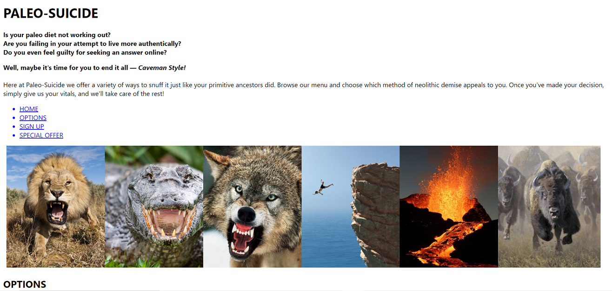

# One-Page Website
I created this website to utilize CSS and Javascript. It is a personal project and the subject matter, of course, is not to be taken seriously.

The site includes a navigation section leading the user to the various sections. The main section consists of a collection of images tied to a particular service. These are initially arranged in the form of a slideshow. Afterward, they are listed one by one, followed by a link to a Youtube video. At the bottom of the page is a sign-up form.

